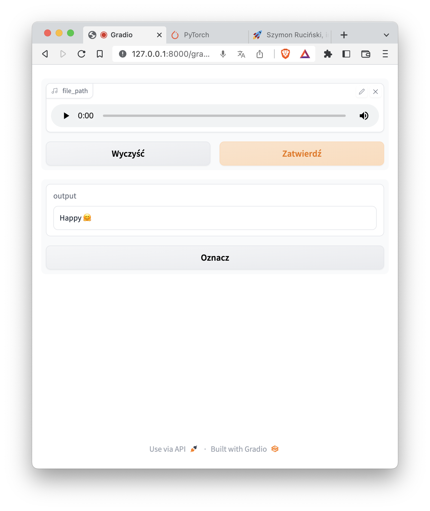
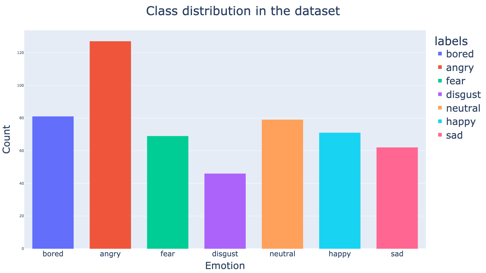
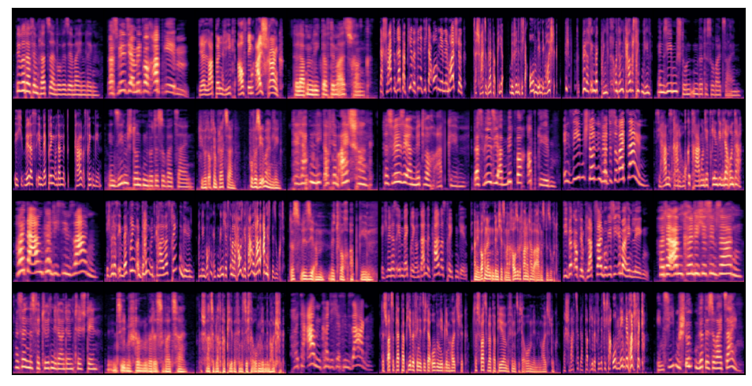

# Emotion recognition
### Introduction 
The goal of the following project is to build a production ready API and application. That based on the audio is capable to classify customers emotions based on the recordings. Model was trained on images that are *MEL* spectrograms of audio files. Model is trained from scratch and uses AlexaNet architecture to classify emotions.

<p align="center">
  
  
</p>


### Client
Application provides an intuitive interface for the user. It allows to upload audio files and get predictions.

<p align="center">
  
</p>

### Dataset
Used dataset is called EMO-DB. It contains 4,5k audio files with 8 emotions. Dataset is available [here](https://www.emodb.bilderbar.info/download/). It contains recordings of 10 different speakers. Each speaker recorded 15 sentences in 7 different emotions. Each sentence was recorded 3 times in German language.


### Architecture
Model is based on AlexNet architecture. It was chosen because of its simplicity and good performance. It is composed of 5 convolutional layers and 3 fully connected layers. It uses ReLU activation function and max pooling. It was trained for 10 epochs with batch size of 32. It achieved 0.7 accuracy on validation set.


Convolutional layers are used to extract features from images. Fully connected layers are used to classify images. Max pooling is used to reduce the size of the image. ReLU activation function is used to introduce non-linearity to the model. Network is being trained on the following MEL spectrograms.



### Stack
This application was written in Python Models were trained using Pytorch. It uses FastAPI to expose API.
It uses Docker to containerize the application. It uses Pytorch to build the model. It uses Librosa to extract features from audio files. It uses Pandas to load and manipulate data. It uses Numpy to manipulate data. It uses Matplotlib to plot data. It uses Scikit-learn to split data into train and test sets. It uses Scipy to save and load model.
### Build 
*run_docker.sh* script contains all necessary command to build and run container.
It will run container and expose API and JupyterNotebook server on ports *4444* and *8888*.

 ```sh
 chmod +x run_docker.sh
 docker.sh
 ```

### Accessing JupyterNotebooks 

### Querying Flask API 
Api was tested using postman. It can be queried using the following configuration.

