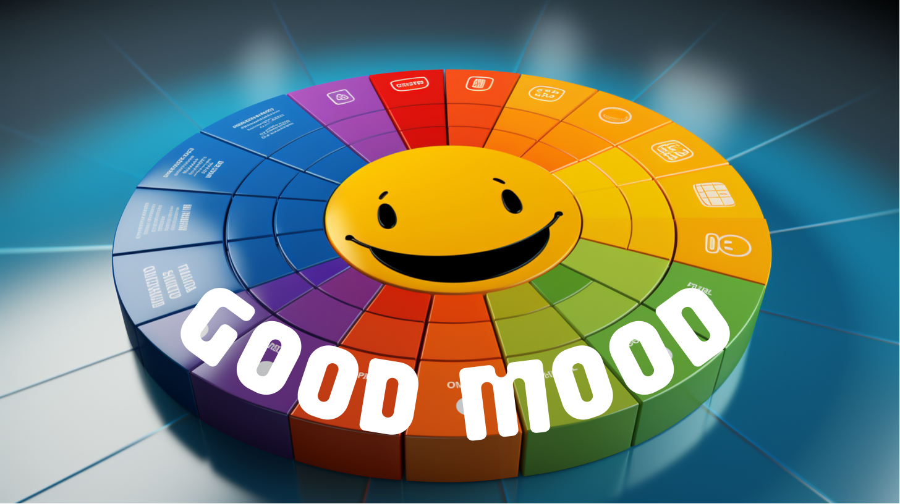
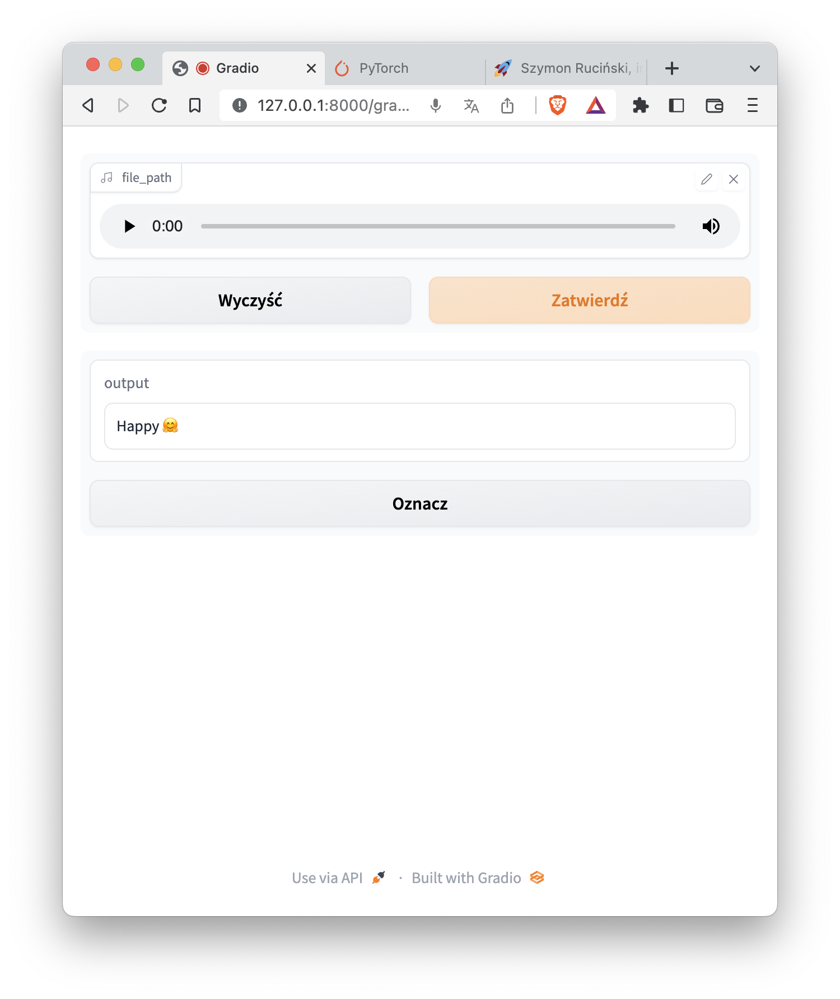

<p align="center">
  
</p>

# Good Mood — Speech Emotion Recognition

Classify the emotion in a speech recording from its **MEL spectrogram**.
A short clip is rendered to a spectrogram image, which a fine-tuned **ResNet18**
classifies into one of 7 emotions. Served as a **FastAPI + Gradio** web app.

<p align="center">
  
</p>

## Emotions

`angry 😡` · `bored 🥱` · `disgust 🤮` · `fear 🫣` · `happy 🤗` · `neutral 😶` · `sad 😭`

## Dataset

[EMO-DB](https://www.emodb.bilderbar.info/download/) — 535 German emotional-speech
clips from 10 speakers. The emotion is encoded in the 6th character of each
filename. Downloaded into `data/raw/` and rendered to MEL-spectrogram PNGs in
`data/preprocessed/images/`.

## Architecture

ResNet18 pretrained on ImageNet, with the final FC layer replaced for 7 classes
and the whole network fine-tuned. Inputs are 224×224 spectrogram images
normalized with ImageNet statistics. Training is **fully seeded** (python, numpy,
torch, CUDA, DataLoader workers) and the split uses a fixed `random_state`, so
runs are reproducible. The best model (lowest validation loss) is checkpointed
to `model.pt` as a portable dict (`model_state` + `classes` + metadata).

Train / validation / test split is stratified 80 / 10 / 10. Validation drives
early stopping + LR scheduling; the **test** set is touched only once, at the end.

> Training and serving share one preprocessing module (`utils/core.py`), so the
> spectrogram, image size, normalization and label order are guaranteed identical
> — no train/serve skew.

## Stack

Python · PyTorch / torchvision · librosa · scikit-learn · FastAPI · Gradio ·
[uv](https://docs.astral.sh/uv/) for reproducible env management · Docker.

## Setup (reproducible via uv)

```sh
uv sync                       # create .venv from uv.lock (exact, pinned)
```

`uv.lock` pins every dependency (incl. CUDA-12.4 torch wheels) to exact versions
+ hashes, so the environment rebuilds identically on any machine.

## Train

```sh
uv run python -m pipeline.get_data        # download EMO-DB into data/raw/
uv run python -m pipeline.train --epochs 40   # -> writes model.pt
```

Training auto-selects CUDA → MPS → CPU. Useful flags: `--lr`, `--batch-size`,
`--patience`, `--seed`, `--device`.

## Serve

```sh
uv run uvicorn main:app --host 0.0.0.0 --port 8000
```

- UI:     <http://localhost:8000/>
- Health: <http://localhost:8000/health>

## Trained model (Hugging Face Hub)

The trained model is published at
**[szymonrucinski/good-mood-emotion](https://huggingface.co/szymonrucinski/good-mood-emotion)**.
It is fetched automatically — the serving app downloads it on first startup, and
Docker bakes it in at build time. To fetch it manually:

```sh
uv run python -m pipeline.get_model      # -> downloads model.pt
```

Point at a different checkpoint with the `MODEL_REPO` env var. The repo is public,
so no token is needed. To regenerate the model instead, run the training steps above.

## Docker

The image pulls the model from the Hub at build time (no local `model.pt`
needed):

```sh
chmod +x start_docker.sh
./start_docker.sh
```

The image installs the exact locked dependencies (`uv sync --frozen`), bakes in
the model, exposes port 8000, and has a `/health` HEALTHCHECK. Override the model
source with `docker build --build-arg MODEL_REPO=<user>/<repo>`.
